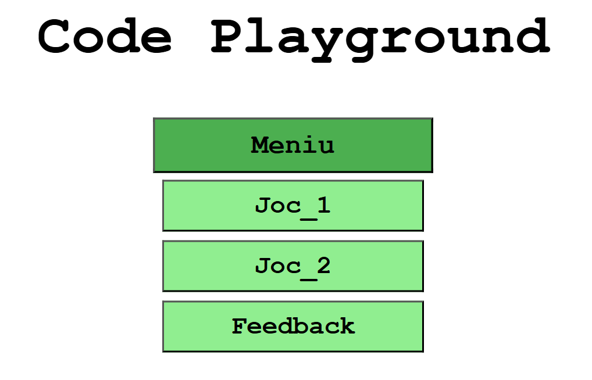
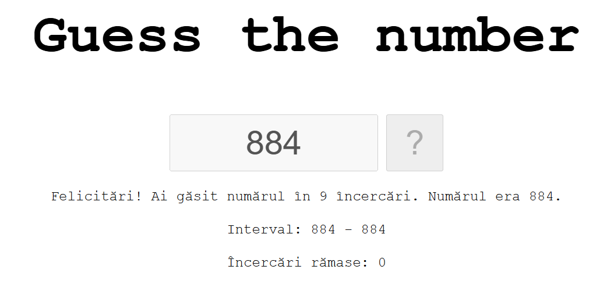
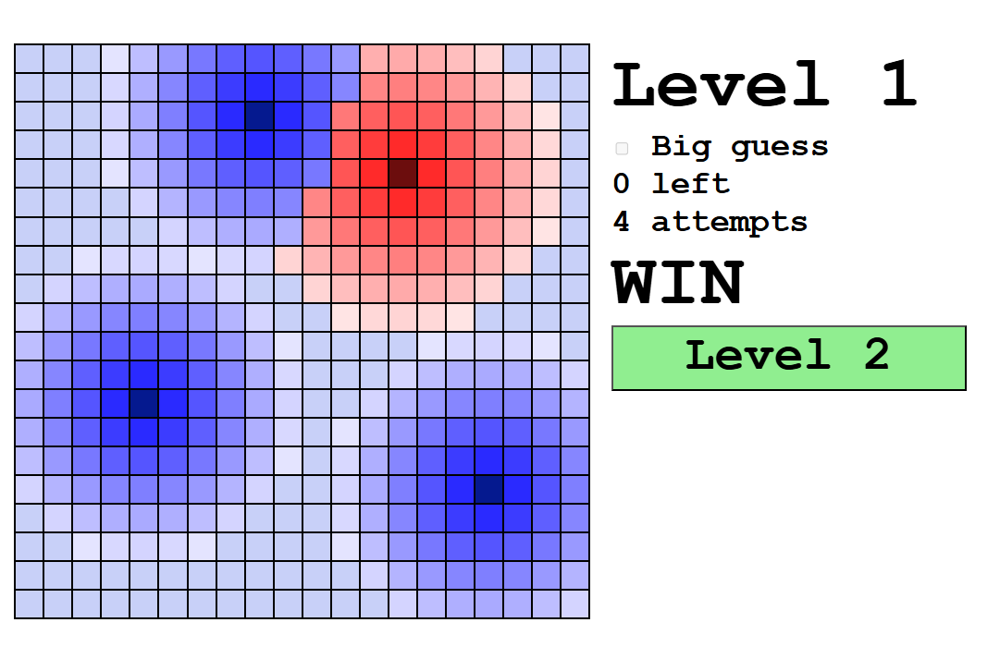
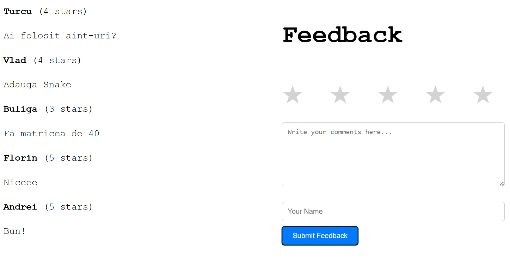

# Site cu Jocuri și Feedback

Acest site conține 3 secțiuni principale:
1. **Jocul 1:** Guess the number
2. **Jocul 2:** Proximity Game
3. **Feedback:** Lasă opinia ta despre site

---

## Jocul 1 – Guess the number
- Scopul este să ghicești un număr generat aleator între 0 și 1000.
- Ai la dispoziție 11 încercări.
- La fiecare încercare, primești indicații dacă numărul căutat e „Mai mare” sau „Mai mic”.
- Este afișat intervalul actualizat și numărul de încercări rămase.
- Scopul este de a învăța cum funcționează căutarea binară.

---

## Jocul 2 – Proximity Game
- Se generează o matrice de 20×20.
- Jocul are mai multe niveluri, fiecare cu puncte „fierbinți” și „reci”.
- Pe măsură ce avansezi, dificultatea crește: apar mai multe puncte de găsit.
- Culoarea celulelor reflectă apropierea față de punctele țintă.
- Ai la dispoziție un număr limitat de „hint-uri” (big tries) pentru a obține indicii.

---

## Feedback
- Utilizatorii pot lăsa un nume, un comentariu și o notă (rating).
- Ultimele 5 feedback-uri sunt salvate local (localStorage) și afișate automat.

---

## Cum rulezi local
Clonează acest repository:
   ```bash
   git clone https://github.com/username/repo-name.git
```
Pentru a deschide site-ul, deschide fișierul `proiect.html` în browser.

## Imagini

<table>
  <tr>
    <td></td>
    <td></td>
  </tr>
  <tr>
    <td></td>
    <td></td>
  </tr>
</table>
